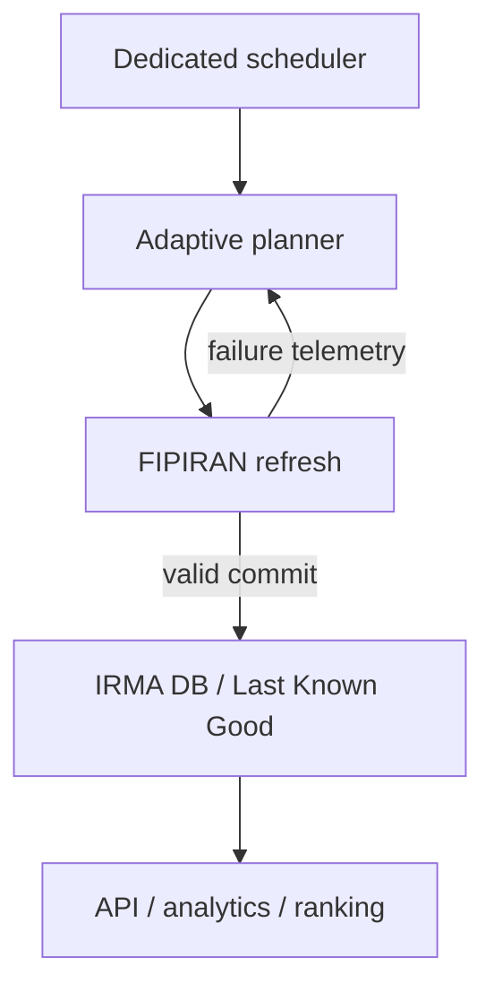

# Provider صندوق FIPIRAN

قرارداد معتبر فعلی `services-v1` است:

- `POST /services/fund/fundcompare/`
- `GET /services/chart/getfundchart?regno=...&showAll=true`

## Catalogue identity

The Catalogue's `regNo` is not a row identity. The validated full-catalogue key is
`(regNo, groupId)`, persisted as `fipiran:{regNo}:{groupId}`. `insCode` is retained at
the provider boundary but is nullable, and `smallSymbolName` is not unique. Exact
duplicate rows with the same composite identity are ignored; conflicting rows with
the same composite identity are rejected as a contract violation.

The full-catalogue audit found 21 duplicated `regNo` values: 14 had groups `(1, 2)`,
six had `(1, 2, 3)`, and one had `(1, 2, 3, 4)`. Every duplicated `regNo` included
group 1. `regNo` and symbol therefore fail uniqueness; `insCode` cannot be the primary
key because it is optional. `(regNo, groupId)` uniquely identified the audited rows;
the defensive `(regNo, groupId, insCode)` adds no identity value and would make null
handling part of the key.

The public History endpoint accepts only `regno`; no supported `groupId` or `insCode`
selector was found. IRMA therefore compares the newest History `cancelNav` and
`statisticalNav` with every Catalogue row sharing that `regNo`. History is written
only when exactly one row matches. Missing, mismatched, or ambiguous History is
reported in `history_errors` and never attached to another group.

انتخاب قرارداد با `IRMA_FIPIRAN_CONTRACT` انجام می‌شود. مقدار `auto` فقط میان
قراردادهایی انتخاب می‌کند که Fixture و تست مستقل دارند؛ قرارداد ناشناخته خودکار فعال
نمی‌شود. مسیرها، Base URL و User-Agent قابل تنظیم‌اند.

Client یک Session و Connection Pool محدود دارد. فقط خطاهای 408، 425، 429 و 5xx با
Backoff، Jitter و رعایت `Retry-After` تکرار می‌شوند. HTML، Captcha، Block Page،
Content-Type غیر JSON و Schema ناسازگار شکست قرارداد محسوب می‌شوند.

Circuit Breaker پس از تعداد شکست تنظیم‌شده باز می‌شود، در Cooling Period درخواست
نمی‌فرستد و سپس فقط یک درخواست آزمایشی می‌پذیرد. Fixture هرگز fallback تولید نیست.

بررسی ۳۰ ژوئیه ۲۰۲۶ از محیط Agent برای دامنه‌های عمومی با پاسخ HTML 502 از Proxy و
`Connection refused` شکست خورد. این نتیجه محدودیت مسیر شبکه را نشان می‌دهد و تغییر
Endpoint یا نیاز Header را اثبات نمی‌کند.

## Adaptive refresh و Last Known Good

FIPIRAN فقط مسیر نوشتن/به‌روزرسانی است؛ API، تحلیل و رتبه‌بندی همواره از DB می‌خوانند.
در نتیجه قطع منبع نه liveness را خراب می‌کند و نه داده معتبر قبلی را حذف می‌کند.

worker مستقل `python -m irma.workers.scheduler` تنها مالک scheduling است. در Docker با
profile `scheduler` اجرا می‌شود. علاوه بر قفل درون‌پردازه‌ای، lease دیتابیسی مانع refresh
هم‌زمان از scheduler، API یا چند worker می‌شود. lease منقضی‌شونده است تا crash باعث قفل
دائمی نشود.

planner روز را به bucketهای یک‌ساعته در `Asia/Tehran` تقسیم می‌کند. امتیاز هر bucket:

`0.60 × success rate + 0.20 × (1-timeout rate) + 0.10 × history completion + 0.10 × latency score`

تا پیش از حداقل نمونه، windowها «insufficient» هستند و bootstrap گسترده 06، 14 و 22
با jitter استفاده می‌شود؛ این ساعت‌ها ادعای بهترین زمان نیستند. پس از یادگیری، windowهای
قابل اتکا با حداقل فاصله انتخاب می‌شوند و exploration محدود مانع گیرکردن planner می‌شود.
telemetry به‌صورت UTC ذخیره، در rolling lookback محاسبه و پس از retention حذف می‌شود.

سه شکست پیاپی mode را به `degraded` و شش شکست به `daily_fallback` می‌برد. موفقیت بعدی
وارد `recovering` می‌شود و سه موفقیت پیاپی `online_preferred` را برمی‌گرداند. حتی در
fallback تقریباً سه فرصت adaptive روزانه باقی می‌ماند.

`POST /v1/funds/latest` ابتدا freshness را می‌سنجد. داده تازه مستقیماً بازگردانده می‌شود؛
داده stale فقط یک refresh محدود و coalesced ایجاد می‌کند. شکست refresh همراه با timestamp
و `stale_warning` داده Last Known Good را برمی‌گرداند. نبود snapshot یک وضعیت معتبر
`missing` است، نه خطای کلی برنامه. diagnostics شفاف در
`GET /v1/providers/funds/refresh-status` شامل mode، freshness، آخرین attempt/success،
source observation، failure، زمان بعدی و امتیاز تمام bucketهاست.

catalogue در هر فرصت refresh می‌شود، اما history با `IRMA_FUND_HISTORY_LIMIT` محدود و
بر اساس کمترین پوشش قبلی catch-up می‌شود؛ query کاربر full-history rebuild ایجاد نمی‌کند.
Retryها bounded exponential backoff و jitter دارند، `Retry-After` رعایت می‌شود و circuit
breaker درخواست‌های شکست‌خورده متوالی را متوقف می‌کند.
